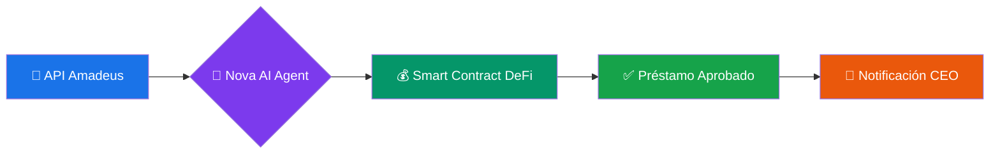

# 🚀 AMADEUS LIQUIDITY AGENT - Documento Maestro de Ejecución

> **CFO Autónomo para Agencias de Viajes** | Hackathon Genesis Amadeus | Categoría: Soft Hack (Ideación)
> 
> ⏰ **Deadline:** Domingo 18:00 | 🎯 **Estrategia:** MVP Radical - Solo Happy Path

---

## SECCIÓN 1: PRD DEL MVP (Core Functionality)

### 🎯 User Story Principal

> *"Como dueño de agencia de viajes, quiero que mi Agente de IA detecte automáticamente que no podré pagar al BSP (IATA) en 3 días y solicite liquidez DeFi de forma instantánea, para evitar multas, suspensiones y la muerte de mi negocio."*

---

### 📊 Flujo Único a Demostrar (Happy Path)



---

### 📥 INPUTS (Datos Simulados)

| Fuente | Dato | Valor Demo | Propósito |
|--------|------|------------|-----------|
| **Amadeus API** | PNR Status | 47 reservas confirmadas | Validar ventas futuras |
| **Amadeus API** | Revenue proyectado | $125,000 USD | Colateral para préstamo |
| **Sistema Agencia** | Deuda BSP actual | $85,000 USD | Trigger de necesidad |
| **Sistema Agencia** | Cash disponible | $12,000 USD | Detectar déficit |
| **Sistema Agencia** | Días para vencimiento | 3 días | Urgencia |

**Estructura JSON de la API (para slides):**
```json
{
  "agency_id": "AG-2024-LATAM",
  "financial_snapshot": {
    "cash_available": 12000,
    "bsp_debt_due": 85000,
    "days_to_deadline": 3
  },
  "amadeus_validated_sales": {
    "confirmed_pnrs": 47,
    "projected_revenue": 125000,
    "confidence_score": 0.94
  },
  "agent_recommendation": {
    "action": "REQUEST_DEFI_LOAN",
    "amount": 73000,
    "collateral_ratio": 1.47,
    "risk_level": "LOW"
  }
}
```

---

### 🧠 LÓGICA DEL AGENTE (Nova AI)

#### Regla de Decisión Principal:
```
SI (Cash_Disponible < Deuda_BSP) 
   Y (Ventas_Futuras_Validadas > Deuda_BSP × 1.2)
   Y (Días_Para_Vencimiento <= 5)
ENTONCES
   → Calcular monto_préstamo = Deuda_BSP - Cash_Disponible
   → Ejecutar solicitud a Smart Contract DeFi
   → Notificar al dueño con un clic de confirmación
```

#### Pseudocódigo del Agente (para presentación):
```python
class AmadeusLiquidityAgent:
    """CFO Autónomo - Powered by Nova AI"""
    
    def analyze_financial_health(self, agency_data, amadeus_data):
        cash = agency_data['cash_available']
        debt = agency_data['bsp_debt']
        future_sales = amadeus_data['validated_revenue']
        
        # Regla de colateral: Ventas deben cubrir 120% de la deuda
        collateral_ratio = future_sales / debt
        
        if cash < debt and collateral_ratio >= 1.2:
            return self.trigger_defi_loan(debt - cash, future_sales)
        
        return {"status": "HEALTHY", "action": "NONE"}
    
    def trigger_defi_loan(self, amount_needed, collateral):
        """Solicita préstamo instantáneo a protocolo DeFi"""
        return {
            "action": "LOAN_REQUESTED",
            "amount": amount_needed,
            "collateral_locked": collateral,
            "estimated_apr": 8.5,
            "approval_time": "< 30 seconds"
        }
```

---

### 📤 OUTPUTS

| Output | Descripción | Formato |
|--------|-------------|---------|
| **Transacción Blockchain** | Hash del préstamo aprobado en red DeFi | `0x7a8f...3b2c` |
| **Notificación Push** | Alerta al CEO con resumen y 1-click confirm | UI Mobile/Desktop |
| **Dashboard Update** | Estado del cash flow actualizado en tiempo real | Widget visual |
| **Recibo Digital** | Términos del préstamo, APR, fecha de pago | PDF/On-chain |

#### Pseudocódigo Smart Contract (Solidity - para slides):
```solidity
// SPDX-License-Identifier: MIT
pragma solidity ^0.8.19;

contract AmadeusLiquidityPool {
    
    struct LoanRequest {
        address agency;
        uint256 amount;
        uint256 collateralValue;  // Validado por oráculo Amadeus
        uint256 apr;
        bool approved;
    }
    
    // Oráculo que conecta con API Amadeus
    address public amadeusOracle;
    
    function requestLoan(
        uint256 _amount,
        bytes calldata _amadeusProof  // Firma de ventas validadas
    ) external returns (uint256 loanId) {
        
        // Verificar prueba de ventas futuras vía oráculo
        require(
            IAmadeusOracle(amadeusOracle).verifyRevenue(_amadeusProof),
            "Invalid Amadeus proof"
        );
        
        // Si el colateral cubre 120%+, aprobar instantáneamente
        uint256 collateral = IAmadeusOracle(amadeusOracle)
            .getValidatedRevenue(msg.sender);
            
        require(
            collateral >= (_amount * 120) / 100,
            "Insufficient collateral"
        );
        
        // Transferir fondos y registrar préstamo
        _disburseLoan(msg.sender, _amount);
        
        emit LoanApproved(msg.sender, _amount, collateral);
        return loanId;
    }
}
```

---

## SECCIÓN 2: SCOPE OF WORK (SoW) - Micro-tareas

> 🎯 **Regla de Oro:** Si no suma puntos en la rúbrica de ideación, NO SE HACE.

---

### 🅰️ TRACK A: Narrativa y Negocio (El "Por Qué")

| # | Tarea | Duración | Owner | Entregable | Prioridad |
|---|-------|----------|-------|------------|-----------|
| A1 | Redactar Problem Statement (dolor de PyMEs) | 1h | - | 1 párrafo killer | 🔴 CRÍTICA |
| A2 | Escribir Solution Summary (cómo lo resolvemos) | 1h | - | 1 página | 🔴 CRÍTICA |
| A3 | Definir Value Proposition Canvas | 1h | - | Diagrama visual | 🟡 ALTA |
| A4 | Crear Modelo de Ingresos (Revenue Model) | 1.5h | - | Tabla + gráfico | 🟡 ALTA |
| A5 | Diseñar Go-to-Market simplificado | 1h | - | Funnel visual | 🟢 MEDIA |
| A6 | Escribir Executive Summary (Whitepaper) | 2h | - | 2 páginas max | 🔴 CRÍTICA |
| A7 | Preparar Q&A anticipadas del jurado | 1h | - | 10 preguntas + respuestas | 🟢 MEDIA |

**Checklist Track A:**
- [ ] A1: Problem Statement redactado
- [ ] A2: Solution Summary completo
- [ ] A3: Value Proposition Canvas
- [ ] A4: Modelo de Ingresos definido
- [ ] A5: Go-to-Market slide
- [ ] A6: Executive Summary (Whitepaper)
- [ ] A7: Q&A preparadas

---

### 🅱️ TRACK B: Visual & UX (El "Wow Factor") ⭐ PRIORIDAD MÁXIMA

| # | Tarea | Duración | Owner | Entregable | Prioridad |
|---|-------|----------|-------|------------|-----------|
| B1 | Wireframes del Dashboard (baja fidelidad) | 1.5h | - | 3-4 pantallas en papel/Figma | 🔴 CRÍTICA |
| B2 | Design System (colores, tipografía, componentes) | 1h | - | Style guide en Figma | 🔴 CRÍTICA |
| B3 | Dashboard Principal - High Fidelity | 2h | - | Figma interactivo | 🔴 CRÍTICA |
| B4 | Pantalla de Alerta de Liquidez | 1.5h | - | Modal + notificación | 🔴 CRÍTICA |
| B5 | Pantalla de Confirmación de Préstamo | 1h | - | Success state | 🟡 ALTA |
| B6 | Animaciones y micro-interacciones | 1h | - | Prototyping en Figma | 🟡 ALTA |
| B7 | Storyboard del Video Demo | 1h | - | 8-10 frames con script | 🔴 CRÍTICA |
| B8 | Grabación del Video Demo | 2h | - | Video 2-3 min | 🔴 CRÍTICA |
| B9 | Edición y post-producción del video | 1.5h | - | Video final con música | 🟡 ALTA |

**Checklist Track B:**
- [ ] B1: Wireframes completados
- [ ] B2: Design System definido
- [ ] B3: Dashboard High-Fidelity
- [ ] B4: Pantalla de Alerta
- [ ] B5: Pantalla de Confirmación
- [ ] B6: Animaciones básicas
- [ ] B7: Storyboard del video
- [ ] B8: Video grabado
- [ ] B9: Video editado

---

### 🅲 TRACK C: Arquitectura Técnica (La "Credibilidad")

| # | Tarea | Duración | Owner | Entregable | Prioridad |
|---|-------|----------|-------|------------|-----------|
| C1 | Diagrama de Arquitectura General | 1.5h | - | Diagrama en Mermaid/Draw.io | 🔴 CRÍTICA |
| C2 | Diagrama de Flujo de Datos | 1h | - | Data flow visual | 🔴 CRÍTICA |
| C3 | Documentar integración API Amadeus | 1h | - | Endpoints + JSON samples | 🟡 ALTA |
| C4 | Pseudocódigo del Smart Contract | 1.5h | - | Solidity comentado | 🔴 CRÍTICA |
| C5 | Diseñar estructura de Base de Datos | 1h | - | ERD simplificado | 🟢 MEDIA |
| C6 | Documentar stack tecnológico propuesto | 0.5h | - | Lista con justificaciones | 🟡 ALTA |
| C7 | Security considerations (1 pager) | 0.5h | - | Bullet points | 🟢 MEDIA |

**Checklist Track C:**
- [ ] C1: Diagrama de Arquitectura
- [ ] C2: Diagrama de Flujo de Datos
- [ ] C3: Documentación API Amadeus
- [ ] C4: Pseudocódigo Smart Contract
- [ ] C5: Estructura de BD
- [ ] C6: Stack tecnológico
- [ ] C7: Consideraciones de seguridad

---

### 🎤 TRACK D: Pitch Deck (La Presentación Final)

| # | Tarea | Duración | Owner | Entregable | Prioridad |
|---|-------|----------|-------|------------|-----------|
| D1 | Definir estructura del pitch (slides outline) | 0.5h | - | 10-12 slides definidos | 🔴 CRÍTICA |
| D2 | Slide 1-3: Problema y contexto | 1h | - | Slides diseñados | 🔴 CRÍTICA |
| D3 | Slide 4-6: Solución y Demo | 1.5h | - | Slides + video embebido | 🔴 CRÍTICA |
| D4 | Slide 7-9: Arquitectura y Tech | 1h | - | Diagramas insertados | 🔴 CRÍTICA |
| D5 | Slide 10-12: Modelo de negocio y equipo | 1h | - | Slides finales | 🟡 ALTA |
| D6 | Ensayo del pitch (dry run) | 1h | - | Timing < 5 min | 🔴 CRÍTICA |
| D7 | Ajustes finales post-ensayo | 0.5h | - | Deck pulido | 🟡 ALTA |

**Checklist Track D:**
- [ ] D1: Estructura del pitch
- [ ] D2: Slides Problema
- [ ] D3: Slides Solución + Demo
- [ ] D4: Slides Arquitectura
- [ ] D5: Slides Negocio
- [ ] D6: Dry run completado
- [ ] D7: Ajustes finales

---

## SECCIÓN 3: CRONOGRAMA "FIN DE SEMANA" 📅

> ⚠️ **Deadline Hard:** Domingo 18:00 | Buffer de emergencia: 2 horas

---

### 🌙 VIERNES NOCHE (18:00 - 23:00) — "Alineación y Fundamentos"

| Hora | Track A (Negocio) | Track B (Visual) | Track C (Tech) |
|------|-------------------|------------------|----------------|
| 18:00-18:30 | 🤝 **SYNC GRUPAL:** Revisar PRD, asignar roles, definir canales | ← | ← |
| 18:30-19:30 | A1: Problem Statement | B7: Storyboard Video | C1: Diagrama Arquitectura (inicio) |
| 19:30-20:30 | A2: Solution Summary | B1: Wireframes (inicio) | C1: Diagrama Arquitectura (fin) |
| 20:30-21:00 | 🍕 **BREAK** - Cenar, descansar 30 min | ← | ← |
| 21:00-22:00 | A3: Value Proposition | B1: Wireframes (fin) | C2: Flujo de Datos |
| 22:00-23:00 | 🤝 **SYNC:** Review de avances, ajustar plan sábado | ← | ← |

**Entregables Viernes:**
- [ ] Problem + Solution definidos
- [ ] Storyboard del video listo
- [ ] Wireframes completos
- [ ] Diagrama de arquitectura v1
- [ ] Flujo de datos v1

---

### ☀️ SÁBADO MAÑANA (09:00 - 13:00) — "Construcción Core"

| Hora | Track A (Negocio) | Track B (Visual) | Track C (Tech) |
|------|-------------------|------------------|----------------|
| 09:00-09:15 | ☕ **STANDUP:** Estado, blockers, prioridades del día | ← | ← |
| 09:15-10:15 | A4: Modelo de Ingresos | B2: Design System | C3: Doc API Amadeus |
| 10:15-11:15 | A6: Whitepaper (inicio) | B3: Dashboard HiFi (inicio) | C4: Pseudocódigo Contract |
| 11:15-12:15 | A6: Whitepaper (cont.) | B3: Dashboard HiFi (cont.) | C4: Contract (fin) |
| 12:15-13:00 | A6: Whitepaper (fin) | B3: Dashboard HiFi (fin) | C6: Stack tecnológico |

**Entregables Sábado AM:**
- [ ] Modelo de ingresos completo
- [ ] Whitepaper v1 terminado
- [ ] Design System en Figma
- [ ] Dashboard principal diseñado
- [ ] Pseudocódigo del contrato
- [ ] Documentación API

---

### 🌅 SÁBADO TARDE (14:00 - 20:00) — "Alto Impacto Visual"

| Hora | Track A (Negocio) | Track B (Visual) | Track C (Tech) |
|------|-------------------|------------------|----------------|
| 14:00-14:15 | 🍽️ Post-almuerzo sync rápido | ← | ← |
| 14:15-15:15 | A5: Go-to-Market | B4: Pantalla Alerta Liquidez | C5: Estructura BD |
| 15:15-16:15 | D1: Estructura Pitch | B5: Pantalla Confirmación | C7: Security notes |
| 16:15-17:15 | D2: Slides Problema | B6: Animaciones Figma | Apoyo a Track B |
| 17:15-18:15 | D3: Slides Solución | B6: Animaciones (cont.) | Apoyo a Track D |
| 18:15-18:30 | ☕ **BREAK** | ← | ← |
| 18:30-19:30 | D4: Slides Arquitectura | Preparar assets para video | Review diagramas |
| 19:30-20:00 | 🤝 **SYNC:** Review completo, plan domingo | ← | ← |

**Entregables Sábado PM:**
- [ ] Todas las pantallas Figma completas
- [ ] Animaciones y prototipo funcional
- [ ] Estructura del pitch definida
- [ ] Slides 1-9 en borrador
- [ ] Assets listos para video

---

### ☀️ DOMINGO MAÑANA (09:00 - 13:00) — "Producción Final"

| Hora | Track A (Negocio) | Track B (Visual) | Track C (Tech) |
|------|-------------------|------------------|----------------|
| 09:00-09:15 | ☕ **STANDUP:** Últimos pendientes críticos | ← | ← |
| 09:15-10:15 | D5: Slides Negocio y Equipo | B8: Grabación Video (inicio) | Apoyo grabación |
| 10:15-11:15 | A7: Q&A anticipadas | B8: Grabación Video (fin) | Apoyo grabación |
| 11:15-12:15 | Review Whitepaper final | B9: Edición video (inicio) | Review técnico slides |
| 12:15-13:00 | Integrar todo en Pitch | B9: Edición video (fin) | QA de diagramas |

**Entregables Domingo AM:**
- [ ] Video demo grabado y editado
- [ ] Pitch deck 90% completo
- [ ] Q&A lista
- [ ] Whitepaper versión final

---

### 🏁 DOMINGO TARDE (14:00 - 18:00) — "Pulido y Entrega"

| Hora | Track A (Negocio) | Track B (Visual) | Track C (Tech) |
|------|-------------------|------------------|----------------|
| 14:00-14:30 | 🍽️ Almuerzo + prep mental | ← | ← |
| 14:30-15:30 | D6: **DRY RUN #1** - Ensayo completo | ← | ← |
| 15:30-16:00 | D7: Ajustes post-ensayo | Ajustes visuales | Ajustes técnicos |
| 16:00-16:30 | D6: **DRY RUN #2** - Ensayo final | ← | ← |
| 16:30-17:00 | 📦 **EMPAQUETADO:** Exportar todo en formatos correctos | ← | ← |
| 17:00-17:30 | 🚀 **UPLOAD:** Subir a plataforma de la hackathon | ← | ← |
| 17:30-18:00 | 🎉 **BUFFER:** Margen para imprevistos / Celebrar | ← | ← |

**Entregables Domingo PM (FINALES):**
- [ ] Pitch Deck exportado (PDF + editable)
- [ ] Video Demo subido
- [ ] Whitepaper/Docs subidos
- [ ] Todos los assets en plataforma
- [ ] **SUBMISSION ENVIADO** ✅

---

## 📋 CHECKLIST FINAL DE ENTREGA

### Documentos
- [ ] Pitch Deck (Google Slides/PPT + PDF)
- [ ] Whitepaper / Executive Summary (PDF)
- [ ] README del proyecto

### Assets Visuales
- [ ] Video Demo (MP4, 2-3 min)
- [ ] Figma link público o exportado
- [ ] Diagramas de arquitectura (PNG/SVG)

### Código/Técnico
- [ ] Pseudocódigo del Smart Contract
- [ ] Estructura JSON de API
- [ ] Diagrama de flujo de datos

### Plataforma Hackathon
- [ ] Formulario de inscripción completo
- [ ] Todos los archivos subidos
- [ ] Link al video verificado
- [ ] Descripción del proyecto

---

## 💡 RECORDATORIOS TÁCTICOS

> **🎨 PRIORIZA LO VISUAL:** En un Soft Hack, el jurado compra con los ojos. Un Figma profesional > 1000 líneas de código.

> **🎭 EL FAKE TECNOLÓGICO ES VÁLIDO:** Pseudocódigo bien documentado > Código que compila pero nadie entiende.

> **📖 LA HISTORIA VENDE:** "Las PyMEs mueren porque los bancos tardan 30 días. Nuestro agente resuelve en 30 segundos."

> **⏰ TIMEBOXING ESTRICTO:** Si una tarea se pasa del tiempo, PARA y sigue. El 80% perfecto > 20% perfecto.

> **🤝 COMUNICACIÓN:** Sync cada 3-4 horas. Un blocker no comunicado = tiempo perdido para todos.

---

**¡A GANAR ESTA HACKATHON!** 🏆🚀
