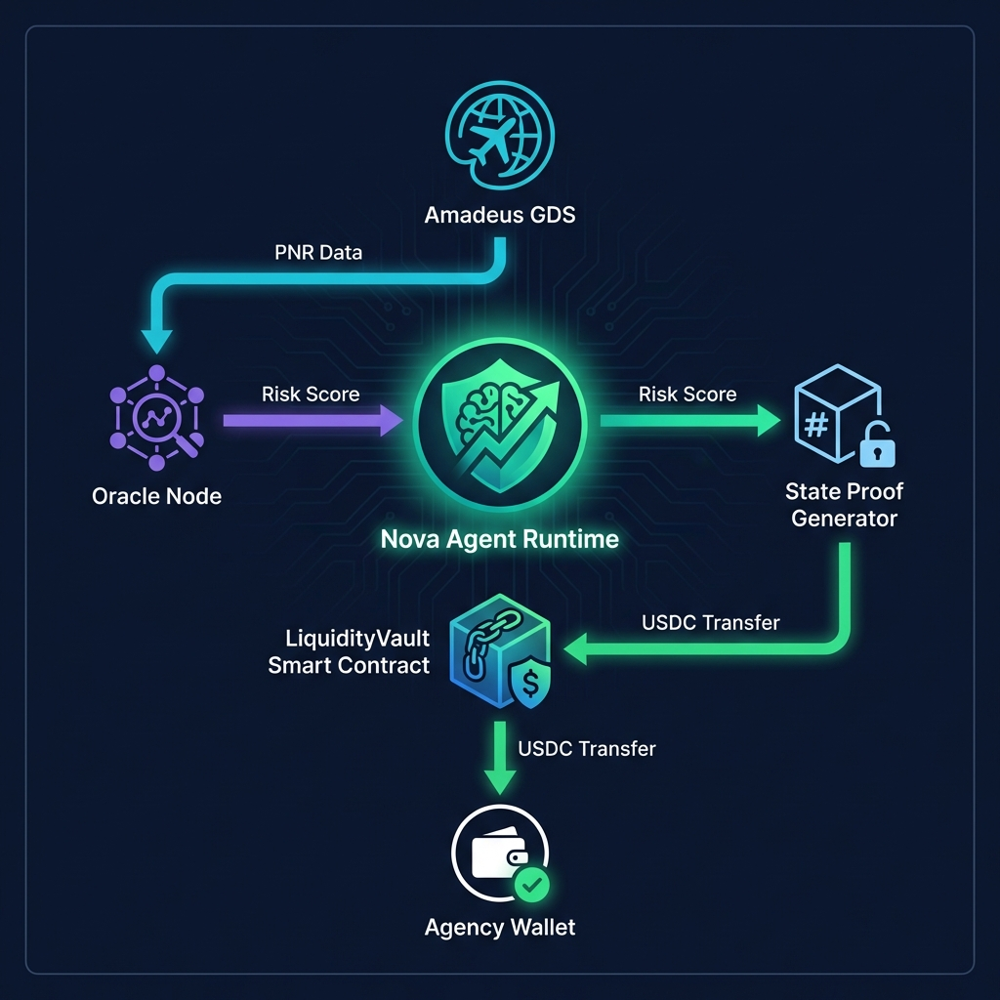

<div align="center">

# 🛫 Amadeus Liquidity Agent

### *Autonomous Liquidity Management for Travel SMEs*

[](https://amadeus.com)
[](https://react.dev)
[](https://soliditylang.org)
[](https://amadeus.com)
[](LICENSE)

**An AI-powered CFO agent that automatically detects liquidity crises in travel agencies and executes instant DeFi loans backed by Amadeus-validated future bookings.**

[Demo Dashboard](#-live-demo) • [Architecture](#-architecture) • [How Amadeus is Used](#-how-amadeus-is-used) • [Tech Stack](#-tech-stack) • [Roadmap](#-roadmap)

</div>

---

## 🚨 The Problem

> **54% of travel agency bankruptcies are caused by cash flow mismatches, not lack of customers.**

Travel agencies face a deadly liquidity trap:

| ❌ **They OWE money** | ❌ **They RECEIVE money** |
|----------------------|--------------------------|
| Every **15 days** to BSP/IATA | **45-90 days** after clients travel |

### The Current "Solution"
- 🏦 Banks take **30+ days** to approve loans
- 📋 Require real estate collateral and 3 years of financial statements  
- 💸 Charge **24-36% APR** interest rates
- ☠️ **Result:** SMEs die waiting

---

## 💡 The Solution

**Amadeus Liquidity Agent** is an autonomous CFO that:

1. **🔍 Monitors** your BSP debt vs. cash balance in real-time
2. **✅ Validates** your future bookings via Amadeus APIs as collateral
3. **⚡ Executes** instant DeFi flash loans when liquidity gaps are detected
4. **🔐 Protects** sensitive passenger data using zero-knowledge proofs

### The Nova Agent Decision Logic

```python
if (cash_balance < bsp_debt) and (future_bookings / gap >= 1.20):
    if (airline_risk_score < 0.50):
        execute_flash_loan(amount=gap)  # ⚡ 30 seconds, not 30 days
```

### Key Metrics Comparison

| Metric | Traditional Bank | Amadeus Agent |
|--------|------------------|---------------|
| Approval Time | 30 days | **30 seconds** |
| Collateral Required | Real Estate | **Your Own Sales** |
| Interest Rate | 24-36% APR | **8-12% APR** |
| Human Intervention | Required | **Zero** |

---

## 🏗 Architecture



*[Replace with your generated Mermaid diagram export]*

### System Components

```
┌─────────────────────────────────────────────────────────────────┐
│                         AMADEUS GDS                             │
│  (PNR Data, BSP Schedule, Flight Status, Agency Profile)       │
└──────────────────────────────┬──────────────────────────────────┘
                               │ REST API / WebSocket
                               ▼
┌─────────────────────────────────────────────────────────────────┐
│                    NOVA AGENT RUNTIME (WASM)                    │
│  • Risk evaluation logic    • State proof generation           │
│  • Collateral calculation   • Decision audit trail             │
└──────────────────────────────┬──────────────────────────────────┘
                               │ State Proof + Decision
                               ▼
┌─────────────────────────────────────────────────────────────────┐
│                     AMADEUS L1 BLOCKCHAIN                       │
│  • LiquidityVault.sol       • USDC Pool    • zk-Verify Oracle  │
└──────────────────────────────┬──────────────────────────────────┘
                               │ USDC Transfer
                               ▼
┌─────────────────────────────────────────────────────────────────┐
│                      AGENCY WALLET                              │
│  • Receives instant liquidity    • Repays on BSP collection    │
└─────────────────────────────────────────────────────────────────┘
```

---

## 🔧 How Amadeus is Used

> **This section details our deep integration with Amadeus Network infrastructure.**

### 1️⃣ Nova Runtime (WASM)

Our liquidity agent logic is compiled to **WebAssembly (WASM)** to run deterministically on the Amadeus Nova Runtime:

- **Why WASM?** Complex GDS JSON parsing would be prohibitively expensive on traditional EVM chains
- **What it does:** Evaluates risk scores by analyzing PNR data, airline reliability, and booking patterns
- **Deterministic execution:** Same input always produces same output across all validator nodes

```rust
// Compiled to agent_logic.wasm
#[no_mangle]
pub fn evaluate_risk(amadeus_data: &[u8]) -> RiskDecision {
    let bookings = parse_gds_json(amadeus_data);
    let risk_score = calculate_airline_portfolio_risk(&bookings);
    // Returns cryptographically signed decision
}
```

### 2️⃣ State Proofs (Privacy-Preserving Collateral)

The agent generates **cryptographic State Proofs** that validate agency solvency without revealing sensitive data:

- ✅ **Proves:** Agency has $65,000 in confirmed future bookings
- ✅ **Proves:** Bookings are with Tier-1 airlines (low risk)
- ✅ **Proves:** Historical payment compliance is 98%+
- ❌ **Does NOT reveal:** Passenger names, flight numbers, or individual ticket values
- 🔒 **GDPR Compliant:** Zero-knowledge techniques protect passenger PII

### 3️⃣ Useful Proof-of-Work (uPoW)

The risk calculation performed by our agent serves as **useful computational work**:

- **Traditional PoW:** Solves arbitrary hash puzzles (wasteful)
- **Our uPoW:** Calculates actual financial risk assessments for travel agencies
- **Double utility:** Secures the network AND provides valuable business intelligence

### 4️⃣ Amadeus API Integration Points

| API Endpoint | Purpose |
|--------------|---------|
| `/bookings/pnr/{id}` | Validate individual bookings |
| `/agencies/{id}/bsp` | Get BSP settlement schedule |
| `/flights/{id}/status` | Real-time flight status for collateral adjustment |
| `/oracle/verify` | Submit and verify state proofs |

---

## 🖥 Live Demo

### Dashboard Preview

The interactive dashboard shows real-time liquidity monitoring:

- **Critical Alert Banner:** Pulsing "LIQUIDITY CRISIS DETECTED" warning
- **KPI Cards:** BSP Debt, Future Collateral, Collateral Ratio
- **Cash Flow Chart:** Visual comparison of debt vs. future sales
- **One-Click Loan Execution:** Animated flow showing Oracle validation → ZK-Proof → Disbursement

### Run Locally

```bash
# Clone the repository
git clone https://github.com/your-team/amadeus-liquidity-agent.git
cd amadeus-liquidity-agent

# Start the frontend dashboard
cd frontend
npm install
npm run dev
# Opens at http://localhost:5173

# Compile smart contracts
cd ../
npx hardhat compile
```

---

## 🛠 Tech Stack

| Layer | Technology | Purpose |
|-------|------------|---------|
| **Frontend** | React 18 + Vite + Tailwind CSS | Premium dark-mode dashboard |
| **Charts** | Recharts | Cash flow visualization |
| **Icons** | Lucide React | Modern icon system |
| **Smart Contracts** | Solidity 0.8.19 + Hardhat | LiquidityVault on-chain |
| **Agent Logic** | Python (Mock) / Rust (Production) | Nova Runtime WASM module |
| **Blockchain** | Amadeus L1 / EVM Compatible | Settlement and proof verification |

### Project Structure

```
amadeus-liquidity-agent/
├── frontend/                 # React Dashboard
│   ├── src/
│   │   ├── App.jsx          # Main dashboard component
│   │   └── index.css        # Tailwind styles
│   └── package.json
├── contracts/               # Solidity Smart Contracts
│   └── AmadeusLiquidityAgent.sol
├── scripts/                 # Deployment scripts
│   └── deploy_diagnostic.js
├── docs/                    # Technical documentation
│   ├── amadeus_api_mock.json
│   ├── nova_agent_logic.py
│   └── LiquidityVault.sol
├── pitch/                   # Hackathon presentation materials
│   ├── CONCEPT_DECK.md
│   ├── ARCHITECTURE_DIAGRAMS.md
│   ├── HOW_AMADEUS_IS_USED.md
│   └── VIDEO_SCRIPT.md
└── README.md
```

---

## 🗺 Roadmap

### Q1 2026: MVP on Testnet ✅ *(Current)*
- [x] Agent decision logic architecture
- [x] Smart contract design (LiquidityVault)
- [x] Interactive dashboard prototype
- [x] Amadeus API integration specification
- [ ] Deployment on Amadeus Testnet

### Q2 2026: Pilot Program
- [ ] Amadeus API sandbox access
- [ ] Pilot with 5 Chilean travel agencies
- [ ] Real-world BSP payment cycle testing
- [ ] Risk model calibration with live data

### Q3 2026: Mainnet Launch
- [ ] Amadeus L1 mainnet deployment
- [ ] $AMA token staking for liquidity providers
- [ ] Expansion to Argentina and LATAM region
- [ ] Integration with major airline BSP systems

### Q4 2026: Scale
- [ ] European market entry
- [ ] Multi-currency support (EUR, GBP)
- [ ] Advanced ML risk models
- [ ] Mobile app for agency owners

---

## 👥 Team

| Role | Expertise |
|------|-----------|
| **Product Lead** | 10+ years Travel Tech, Ex-Amadeus |
| **Blockchain Dev** | Solidity, Rust, DeFi protocols |
| **AI/ML Engineer** | Risk modeling, Nova Runtime |
| **BD Lead** | IATA network, Agency partnerships |

---

## 📄 License

This project is licensed under the MIT License - see the [LICENSE](LICENSE) file for details.

---

<div align="center">

### 🏆 Built for Amadeus Genesis Hackathon 2026

**"No agency should die waiting for a bank."**

[⬆ Back to Top](#-amadeus-liquidity-agent)

</div>
