# Amadeus Liquidity Agent - Architecture Diagram

## Main Flow Diagram (Copy to Mermaid Live Editor)

---

## Sequence Diagram (Agent Decision Flow)

---

## Component Architecture

---

## Risk Evaluation Model

```mermaid
graph TD
    subgraph "Input Data"
        I1[PNR Count] --> R[Risk Engine]
        I2[Total Ticket Value] --> R
        I3[Airline Mix] --> R
        I4[Days to BSP Due] --> R
        I5[Payment History] --> R
    end
    
    subgraph "Risk Calculation"
        R --> R1{Collateral Ratio}
        R --> R2{Portfolio Risk}
        R --> R3{Urgency Score}
        
        R1 -->|>= 1.20x| OK1[✅ Pass]
        R1 -->|< 1.20x| FAIL1[❌ Fail]
        
        R2 -->|< 0.50| OK2[✅ Pass]
        R2 -->|>= 0.50| FAIL2[❌ Fail]
    end
    
    subgraph "Decision"
        OK1 --> D{AND Gate}
        OK2 --> D
        D -->|All Pass| APPROVE[🟢 APPROVE LOAN]
        FAIL1 --> DENY[🔴 DENY LOAN]
        FAIL2 --> DENY
    end
    
    style APPROVE fill:#10b981,color:#fff
    style DENY fill:#ef4444,color:#fff
```

---

## Instructions

1. Go to [Mermaid Live Editor](https://mermaid.live/)
2. Copy any diagram code block above
3. Paste and export as PNG/SVG
4. Insert into your Pitch Deck (Google Slides/PowerPoint)

### Recommended Export Settings:
- Background: Transparent or #0f172a (dark)
- Scale: 2x for high resolution
- Format: SVG for scalability
