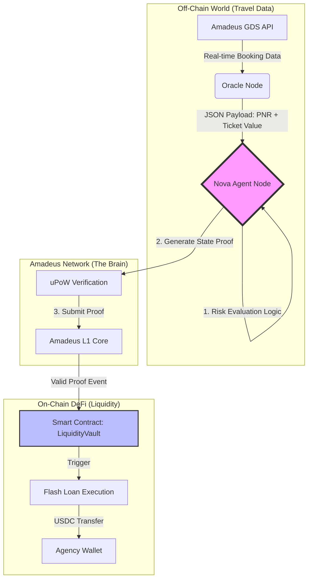

# 🏆 AMADEUS LIQUIDITY AGENT - CONCEPT DECK
## Amadeus Genesis Hackathon | Soft Hack Track

---

# SLIDE 1: THE PROBLEM 💀

## Travel Agencies Are Dying of Cash Flow

> **"54% of travel agency bankruptcies are due to BSP payment defaults, 
> not lack of customers."**

### The Deadly Mismatch:

| 📅 They OWE money to BSP | 📅 They RECEIVE money from clients |
|--------------------------|-------------------------------------|
| **Every 15 days** (hard deadline) | **45-90 days later** (after travel) |

### The Current "Solution" (Banks):
- ❌ Approval time: **30+ days**
- ❌ Requirements: Real estate collateral, 3 years of financial statements
- ❌ Interest: **24-36% APR**
- ❌ Result: **SME dies waiting**

---

# SLIDE 2: THE SOLUTION 🤖

## Amadeus Liquidity Agent
### *Your Autonomous CFO That Never Sleeps*

```
┌─────────────────────────────────────────────────────────────┐
│  "Detects liquidity gaps 72 hours before BSP deadline       │
│   and executes instant DeFi loans backed by YOUR OWN        │
│   future ticket sales - validated by Amadeus data."         │
└─────────────────────────────────────────────────────────────┘
```

### How It Works (30 Seconds):

1. **📡 DETECT** → Agent monitors your BSP debt vs. cash in real-time
2. **🔍 VALIDATE** → Cross-references with Amadeus PNR data (your future sales)
3. **⚡ EXECUTE** → If collateral ratio ≥ 120%, triggers instant DeFi loan
4. **💰 RECEIVE** → USDC in your wallet within seconds, not weeks

### The Magic Numbers:
| Metric | Traditional Bank | Amadeus Agent |
|--------|------------------|---------------|
| Approval Time | 30 days | **30 seconds** |
| Collateral | Real Estate | **Your Own Sales** |
| Interest Rate | 24-36% | **8-12%** |
| Human Intervention | Required | **Zero** |

---

# SLIDE 3: ARCHITECTURE DIAGRAM 🏗️



### Data Flow Explained:
1. **Amadeus GDS** → Provides real-time PNR and booking data
2. **Oracle Node** → Bridges off-chain travel data to on-chain
3. **Nova Agent** → Runs WASM risk evaluation logic
4. **State Proof** → Cryptographic proof of agency solvency
5. **LiquidityVault** → Smart contract that disburses loans
6. **Agency Wallet** → Receives USDC instantly

---

# SLIDE 4: HOW AMADEUS IS USED 🔧

## Technical Integration with Amadeus Network

### 1️⃣ Nova Runtime & WASM
> The Liquidity Agent logic is compiled to **WASM** to run deterministically 
> on the Amadeus Nova Runtime. It parses complex JSON data from the 
> **Amadeus GDS** (booking volumes, cancellation rates, airline mix) 
> which would be too expensive to process on a traditional EVM chain.

### 2️⃣ State Proofs (Agent Identity)
> The agent generates a cryptographic **"Proof of Solvency"** based on the 
> agency's booking history. This allows the DeFi protocol to trust the 
> creditworthiness of the agency **without revealing sensitive passenger data** 
> (GDPR compliant), using Amadeus State Proofs.

### 3️⃣ Risk Evaluation Agent (Vertical Match)
> We deploy a bespoke **risk model** that dynamically adjusts interest rates 
> based on real-time flight data:
> - If a flight is **cancelled** → Collateral value drops automatically
> - If airline has **low risk score** (LATAM, AA) → Better rates
> - If agency has **payment history** on-chain → Reputation bonus

---

# SLIDE 5: THE AGENT LOGIC 🧠

## Decision Engine Pseudocode

```python
def evaluate_liquidity_gap(agency_data):
    """Nova Agent Core Logic - Runs on Amadeus Runtime"""
    
    # 1. Calculate the Gap
    debt = agency_data['bsp_total_debt']      # $50,000
    cash = agency_data['cash_balance']         # $8,500
    cash_gap = debt - cash                     # $41,500 NEEDED
    
    # 2. Validate Collateral (Amadeus PNR Data)
    future_sales = agency_data['confirmed_bookings']  # $65,000
    collateral_ratio = future_sales / cash_gap        # 1.57x ✅
    
    # 3. Risk Assessment (Airline Portfolio)
    risk_score = calculate_airline_risk(agency_data)  # 0.18 (LOW)
    
    # 4. DECISION
    if collateral_ratio >= 1.20 and risk_score < 0.50:
        return execute_flash_loan(amount=cash_gap)  # ⚡ APPROVED
    else:
        return reject_with_reason()  # ❌ DENIED
```

---

# SLIDE 6: SMART CONTRACT 📜

## LiquidityVault.sol (Deployed on Amadeus L1)

```solidity
// SPDX-License-Identifier: MIT
// Integrated with Amadeus zk-Verify Oracle

contract LiquidityVault {
    
    event LiquidityCrunchDetected(string agencyId, uint256 gap);
    event LoanDisbursed(string agencyId, uint256 amount);
    
    function requestLiquidity(
        string memory agencyId,
        uint256 amount,
        bytes memory proofOfSales  // Amadeus State Proof
    ) external {
        // Verify proof via Amadeus Oracle
        require(amadeusOracle.verify(proofOfSales), "Invalid proof");
        
        // Check collateral ratio (120% minimum)
        uint256 collateral = oracle.getCollateralValue(agencyId);
        require(collateral >= amount * 120 / 100, "Low collateral");
        
        // Disburse loan
        emit LoanDisbursed(agencyId, amount);
        usdc.transfer(msg.sender, amount);
    }
}
```

---

# SLIDE 7: MONETIZATION 💵

## Revenue Model: Protocol Fee + Spread

```
┌────────────────────────────────────────────────────────────┐
│                                                            │
│   Agency Pays:  8.5% APR on loan                          │
│                                                            │
│   ├── 5.0% → Liquidity Providers (Stakers)                │
│   ├── 2.0% → Protocol Treasury                            │
│   └── 1.5% → Nova Agent Operators (Gas Rewards)           │
│                                                            │
│   + 0.5% Success Fee per Loan Approved                    │
│                                                            │
└────────────────────────────────────────────────────────────┘
```

### $AMA Token Utility:
- **Stake** $AMA to provide liquidity → Earn yield from agency interest
- **Governance** → Vote on risk parameters (min collateral, max APR)
- **Fee Discounts** → Agencies holding $AMA get reduced rates

---

# SLIDE 8: MARKET SIZE 📊

## Total Addressable Market

| Segment | Annual BSP Volume | Potential Protocol Fees |
|---------|-------------------|-------------------------|
| LATAM Agencies | $18B | $180M (1% fee) |
| Europe SMEs | $42B | $420M |
| Asia-Pacific | $28B | $280M |
| **TOTAL** | **$88B** | **$880M** |

### Pilot Target (Year 1):
- Focus: **Chile + Argentina**
- Target Agencies: **500**
- Loan Volume: **$50M**
- Revenue: **$2.5M** (5% of volume)

---

# SLIDE 9: TEAM 👥

## Sentinel-AI Team

| Role | Background |
|------|------------|
| **CEO / Product** | Ex-Amadeus, 10yr Travel Tech |
| **CTO / Blockchain** | Solidity + Rust, DeFi protocols |
| **Lead AI** | ML Engineer, Risk Models |
| **BD / Partnerships** | IATA Network, Agency Relations |

### Advisory:
- Former BSP Settlement Director (IATA)
- DeFi Protocol Founder (Top 50 TVL)

---

# SLIDE 10: THE ASK 🎯

## What We're Building

### ✅ Completed (This Hackathon):
- Agent logic architecture (Nova WASM)
- Smart contract design (LiquidityVault)
- Risk evaluation model (Airline matrix)
- Technical documentation

### 🚧 Next Steps (Post-Hackathon):
- Amadeus API integration (sandbox access)
- Testnet deployment on Amadeus L1
- Pilot with 5 Chilean agencies

### 💰 Seeking:
- **Amadeus API Partnership** (Travel data access)
- **$500K Seed** for 12-month runway
- **Mentorship** from Amadeus Genesis team

---

## 🏆 "We're not building a fintech. 
## We're building the liquidity layer for travel commerce."

---

*Amadeus Liquidity Agent | Genesis Hackathon 2026*
